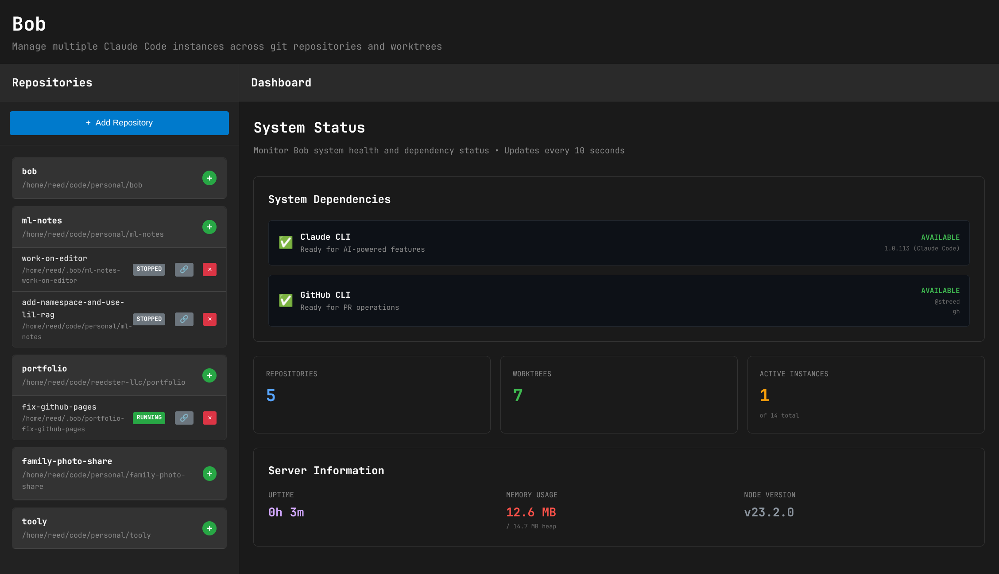

# 🤖 Bob - Your Claude Code Multi-Instance Manager

Meet **Bob**, your friendly neighborhood assistant for managing multiple Claude Code instances across git repositories and worktrees!

Bob helps you juggle multiple projects simultaneously by spinning up isolated Claude Code environments for each git branch or worktree. Think of Bob as your personal dev environment concierge - he keeps your Claude instances organized, running, and ready to help with whatever project you're working on.

## ✨ What Bob Does

**Bob is a web-based management interface that:**

- 🏗️ **Manages Multiple Claude Instances** - Run Claude Code in parallel across different projects and branches
- 🌳 **Git Worktree Integration** - Automatically creates and manages git worktrees for branch isolation
- 🖥️ **Interactive Terminals** - Built-in terminal access to both Claude and your project directories
- 📊 **Real-time Monitoring** - Live status updates, process monitoring, and resource tracking
- 🚀 **One-Click Operations** - Start, stop, restart, and manage instances with simple clicks
- 🔄 **Auto-reconnection** - Persistent terminal sessions that survive browser refreshes
- 💾 **State Persistence** - Remembers your instances and sessions across restarts
- 🎯 **Smart Auto-selection** - Automatically connects to running instances when switching worktrees

## 📸 Screenshots

*[Add screenshots here showing the main interface, terminal sessions, and repository management]*

### Main Interface

*Repository management on the left, terminal interface on the right*

### Instance Management

*Real-time status monitoring and control*

## 🎯 Perfect For

- **Multi-project Developers** working on several codebases simultaneously
- **Feature Branch Development** where each branch needs its own Claude instance
- **Code Review Workflows** comparing implementations across branches
- **Team Environments** sharing access to managed Claude instances
- **CI/CD Integration** automated testing with isolated environments

## 📊 Bob vs. Manual Claude Management

| Feature | Manual Claude CLI | Bob |
|---------|------------------|-----|
| **Multiple Instances** | ❌ Manual terminal juggling | ✅ Web-based dashboard |
| **Project Switching** | ❌ Manual `cd` commands | ✅ One-click selection |
| **Session Persistence** | ❌ Lost on terminal close | ✅ Survives browser restart |
| **Visual Status** | ❌ No unified view | ✅ Real-time monitoring |
| **Worktree Management** | ❌ Manual git commands | ✅ Automated creation/cleanup |
| **Terminal Access** | ❌ Separate windows | ✅ Integrated interface |
| **Process Management** | ❌ Manual kill/restart | ✅ Graceful controls |
| **Team Sharing** | ❌ Individual setups | ✅ Shared web interface |

## 🏃‍♂️ Quick Start

### Prerequisites

- Node.js (v18+)
- Git with worktree support
- [Claude Code CLI](https://claude.ai/code) installed and configured

### Installation & Setup

1. **Clone Bob's Repository**
   ```bash
   git clone <repository-url>
   cd bob
   npm install
   ```

2. **Start Bob's Services**
   ```bash
   # Clean start (recommended for first time or after branch switches)
   npm run dev:clean

   # Or regular start if no conflicts exist
   npm run dev
   ```

3. **Open Bob's Interface**
   Navigate to `http://localhost:5173` in your browser

4. **Add Your First Repository**
   - Click "Add Repository"
   - Enter the path to your git repository
   - Bob will scan and index your project

## 🎮 How to Use Bob

### Adding Repositories

1. Click the **"Add Repository"** button in the left panel
2. Enter or browse to your git repository path
3. Bob automatically detects the repository structure and available branches

### Creating Worktrees & Instances

**Option 1: New Branch Worktree**
1. Select a repository from the left panel
2. Click **"Create Worktree"**
3. Enter a branch name (new or existing)
4. Bob creates the worktree and starts a Claude instance automatically

**Option 2: Existing Worktree**
1. Select an existing worktree from the repository tree
2. Click to select it - Bob automatically starts a Claude instance if needed

### Using the Terminal Interface

Bob provides two types of terminal access for each instance:

**Claude Terminal** 🤖
- Direct interaction with Claude Code
- Full Claude capabilities (code analysis, generation, file operations)
- Persistent across browser sessions

**Directory Terminal** 📁
- Standard bash/shell access to the worktree directory
- Run git commands, build scripts, tests, etc.
- Full filesystem access within the project

### Instance Management

**Starting/Stopping Instances**
- Use the ⚡ **Start** button to launch Claude in a worktree
- Use the ⏸️ **Stop** button to gracefully shutdown an instance
- Use the 🔄 **Restart** button to reboot a problematic instance

**Monitoring Status**
- 🟢 **Running** - Instance is active and ready
- 🟡 **Starting** - Instance is initializing
- 🔴 **Stopped** - Instance is not running
- ❌ **Error** - Instance encountered a problem

### Worktree Operations

**Deleting Worktrees**
- Select a worktree and use the 🗑️ **Delete** option
- Bob will prompt for confirmation and handle cleanup
- Use **Force Delete** if the worktree has uncommitted changes

## 🏗️ Architecture

Bob is built with a modern, scalable architecture:

### Frontend (React + TypeScript)
- **React 18** with hooks and modern patterns
- **Vite** for fast development and building
- **XTerm.js** for terminal emulation
- **WebSocket** connections for real-time terminal interaction

### Backend (Node.js + Express)
- **Express.js** API server
- **WebSocket Server** for terminal sessions
- **SQLite Database** for persistence
- **node-pty** for terminal process management
- **Git integration** for worktree operations

### Key Services

**ClaudeService**
- Manages Claude Code process lifecycle
- Handles instance creation, monitoring, and cleanup
- Implements process isolation and resource management

**TerminalService**
- Creates and manages PTY sessions
- WebSocket message routing and session persistence
- Memory leak protection and cleanup

**GitService**
- Git repository scanning and worktree management
- Branch detection and worktree creation
- Repository metadata tracking

**DatabaseService**
- SQLite-based persistence layer
- Repository, worktree, and instance state management
- Optimized queries with JOIN operations for performance

## 🚀 Development

### Project Structure

```
bob/
├── frontend/           # React frontend application
│   ├── src/
│   │   ├── components/ # React components
│   │   ├── contexts/   # React contexts for state management
│   │   ├── hooks/      # Custom React hooks
│   │   └── services/   # Frontend service layers
├── backend/            # Node.js backend application
│   ├── src/
│   │   ├── routes/     # Express route handlers
│   │   ├── services/   # Core business logic services
│   │   ├── database/   # Database layer and migrations
│   │   └── cli/        # Command-line utilities
├── package.json        # Root package with workspace config
└── CLAUDE.md          # Development instructions for Claude
```

### Available Scripts

**Development**
```bash
npm run dev              # Start both frontend and backend
npm run dev:clean        # Clean start (kills existing processes)
npm run dev:frontend     # Start only frontend (port 5173)
npm run dev:backend      # Start only backend (port 3001)
```

**Production**
```bash
npm run build           # Build both frontend and backend
npm run build:frontend  # Build only frontend
npm run build:backend   # Build only backend
```

**Database Management**
```bash
npm run migrate:status   # Check migration status
npm run migrate:up       # Run pending migrations
npm run migrate:down     # Rollback last migration
npm run migrate:reset    # Reset database (dev only)
npm run migrate:create   # Create new migration
```

### Development Tips

**Branch Switching**
When switching git branches during development, always use:
```bash
npm run dev:clean
```
This prevents "horribly broken" states where multiple dev servers conflict.

**Database Changes**
Create migrations for any schema changes:
```bash
npm run migrate:create add_new_feature
```

**Debugging**
- Backend logs appear in the terminal running `npm run dev`
- Frontend errors show in browser dev console
- WebSocket connections can be monitored in Network tab

## 🔧 Configuration

### Environment Variables

**Backend (.env)**
```bash
PORT=3001                    # Backend server port
DB_PATH=./bob.sqlite         # Database file location
NODE_ENV=development         # Environment mode
```

**Frontend**
Configuration is handled through Vite's environment system.

### Customization

**Terminal Themes**
Edit `frontend/src/components/Terminal.tsx` to customize the terminal appearance:
```typescript
terminal.current = new Terminal({
  theme: {
    background: '#1a1a1a',
    foreground: '#e5e5e5',
    cursor: '#ffffff',
  },
  fontSize: 14,
  fontFamily: 'Monaco, Menlo, "Ubuntu Mono", monospace',
});
```

## 📚 API Reference

### Core Endpoints

**Repositories**
- `GET /api/repositories` - List all repositories
- `POST /api/repositories` - Add new repository
- `DELETE /api/repositories/:id` - Remove repository

**Instances**
- `GET /api/instances` - List all Claude instances
- `POST /api/instances/start/:worktreeId` - Start instance
- `POST /api/instances/stop/:instanceId` - Stop instance
- `POST /api/instances/restart/:instanceId` - Restart instance

**Terminal Sessions**
- `POST /api/instances/terminal/:instanceId` - Create Claude terminal session
- `POST /api/instances/directory/:instanceId` - Create directory terminal session
- `GET /api/instances/sessions/:instanceId` - List active sessions
- `DELETE /api/instances/sessions/:sessionId` - Close session

### WebSocket Protocol

Terminal sessions use WebSocket for real-time communication:

**Message Types**
```typescript
// Client to server
{ type: 'data', data: string }        // Send input to terminal
{ type: 'resize', cols: number, rows: number } // Resize terminal

// Server to client
{ type: 'data', data: string }        // Terminal output
{ type: 'ready' }                     // Session ready
```

## 🤝 Contributing

Bob welcomes contributions! Here's how to get involved:

1. **Fork the Repository** and create a feature branch
2. **Follow the Development Setup** above
3. **Make Your Changes** with appropriate tests
4. **Submit a Pull Request** with a clear description

### Contribution Guidelines

- Follow existing code style and patterns
- Add tests for new functionality
- Update documentation for API changes
- Use descriptive commit messages
- Ensure all tests pass before submitting

## 🛠️ Troubleshooting

### Common Issues

**Claude Code Not Found**
```bash
# Install Claude Code CLI
curl -fsSL https://claude.ai/install.sh | sh

# Verify installation
claude --version
```

**Permission Errors**
- Ensure read/write access to repository directories
- Check git permissions for worktree operations
- Verify Node.js has proper filesystem access

**Port Conflicts**
```bash
# Kill processes using development ports
lsof -ti:5173 | xargs kill -9  # Frontend
lsof -ti:3001 | xargs kill -9  # Backend

# Use clean start
npm run dev:clean
```

**WebSocket Connection Issues**
- Check firewall settings for ports 3001
- Verify WebSocket support in browser
- Monitor network tab for connection errors

**Database Issues**
```bash
# Reset database if corrupted
npm run migrate:reset
npm run migrate:up
```

## 🔮 Roadmap

Future features we're considering for Bob:

- **🌐 Remote Instances** - Manage Claude instances on remote servers
- **👥 Team Collaboration** - Share instances and sessions with team members
- **📈 Analytics Dashboard** - Usage metrics and performance insights
- **🔌 Plugin System** - Extensible architecture for custom integrations
- **🐳 Docker Support** - Containerized Claude environments
- **☁️ Cloud Deployment** - One-click deployment to various cloud providers

## ❓ FAQ

**Q: Why is it called Bob?**
A: Because Bob is your reliable helper who keeps everything organized! Plus, "Bob's your uncle" - it just works! 😄

**Q: Can I run this in production?**
A: Bob is primarily designed for development environments. For production use, consider adding authentication, HTTPS, and proper security measures.

**Q: Does Bob work on Windows?**
A: Yes! Bob works on Windows, macOS, and Linux. The terminal experience may vary slightly based on your system's default shell.

**Q: How many instances can Bob manage?**
A: Bob can theoretically manage dozens of instances, but practical limits depend on your system resources (RAM, CPU, disk space).

**Q: Can I customize the terminal theme?**
A: Absolutely! Check the Configuration section for details on customizing terminal appearance.

## 📜 License

GNU GPLv3 License - feel free to use Bob in your projects!

## 🎉 Credits

Bob was crafted with love using:
- [Claude Code](https://claude.ai/code) - The AI pair programming tool that makes this all possible
- [React](https://reactjs.org/) - Frontend framework for the beautiful UI
- [Node.js](https://nodejs.org/) - Backend runtime powering Bob's services
- [XTerm.js](https://xtermjs.org/) - Terminal emulation that brings the CLI to the web
- [Express.js](https://expressjs.com/) - Web framework handling all the HTTP magic
- [Vite](https://vitejs.dev/) - Lightning-fast build tool
- [TypeScript](https://www.typescriptlang.org/) - Type safety that keeps Bob reliable

Special thanks to all the developers who make the open-source tools that Bob builds upon! 🙏

---

**Happy coding with Bob! 🚀**

*Bob: Because managing multiple Claude instances should be as easy as saying "Bob's your uncle!"*

---

<div align="center">
  <strong>Made with ❤️ for developers who love Claude Code</strong><br>
  <sub>If Bob helps you be more productive, consider starring the repository! ⭐</sub>
</div>
